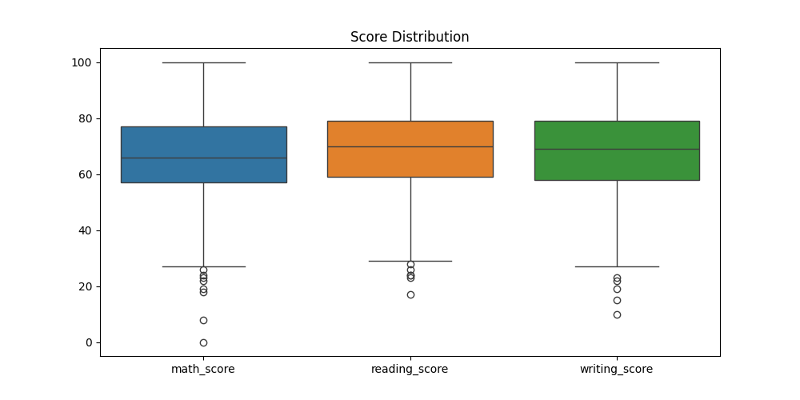
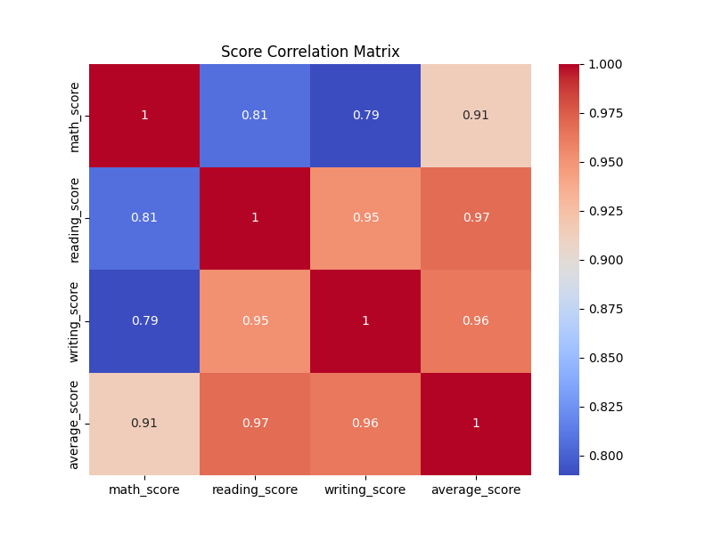
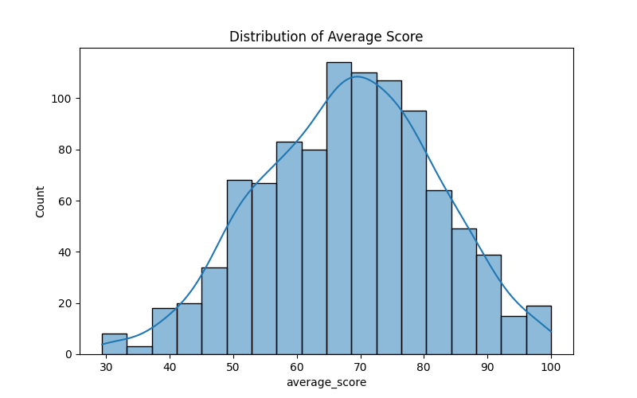
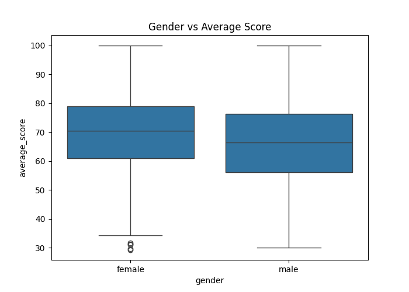
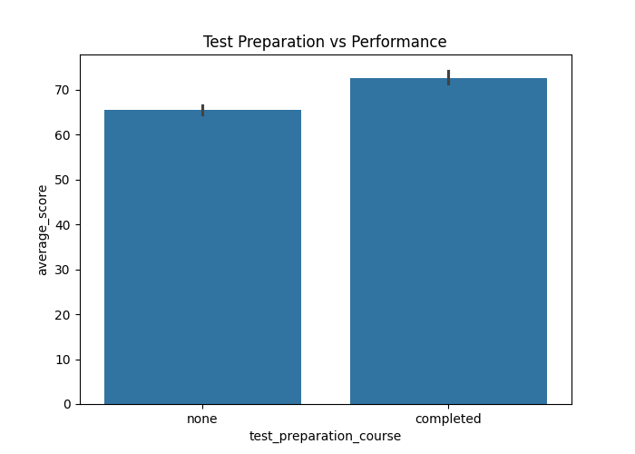
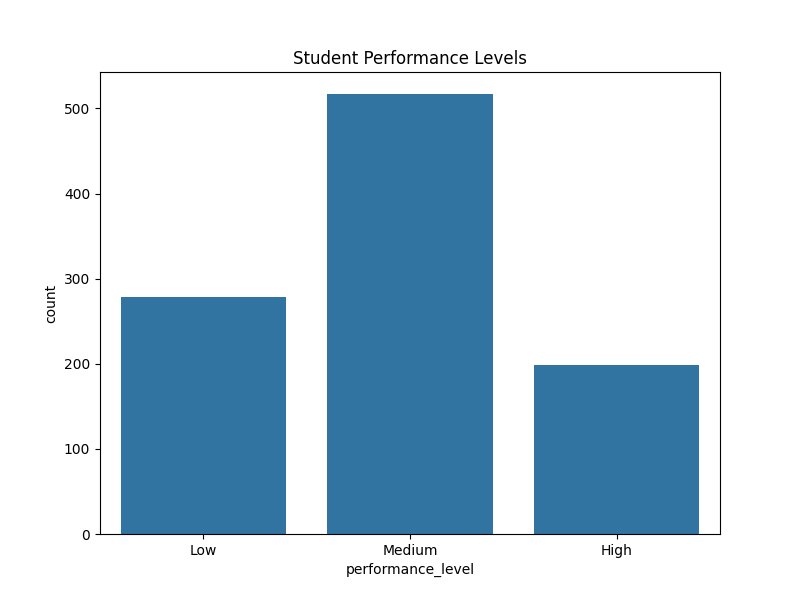
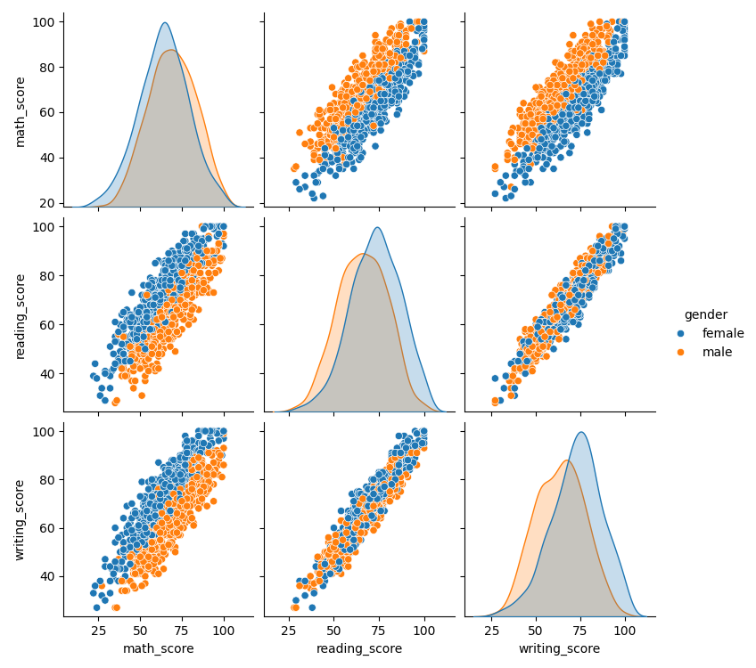

# Student Performance Data Cleaning and Analysis

## 📊 Project Overview
This project provides a comprehensive analysis of student performance data using Python. It involves data cleaning, advanced feature engineering, and statistical visualization to derive meaningful insights into factors influencing academic scores. The workflow processes raw student data to remove inconsistencies, handles missing values, and generates a set of visualizations to understand trends related to gender, test preparation, and other demographics.

## 📂 Project Structure

### Input Data
- **`StudentsPerformance0.csv`**: The raw input dataset containing student demographics and test scores.

### Scripts & Notebooks
- **`advance_data_cleaning_student.py`**: The main Python script that performs data cleaning, analysis, and visualization. It generates the cleaned datasets and helps visualize the data.
- **`advance_data_cleaning_student.ipynb`**: The Jupyter Notebook containing the initial exploratory data analysis (EDA), code experiments, and step-by-step logic.
- **`advance_data cleaning student.ipynb - Colab.pdf`**: A PDF export of the analysis notebook, suitable for quick viewing of the results and code execution flow.

### Output Files (Generated)
- **`cleaned_StudentsPerformance_Cleaned.csv`**: The processed dataset after handling missing values, duplicates, and standardizing columns.
- **`advance_StudentsPerformance_Advanced_Analysis.csv`**: The final enriched dataset containing additional metrics like `average_score` and `performance_level`.
- **`images/`**: A folder containing the generated charts and graphs from the analysis, including distributions, correlations, and comparisons.

## 🚀 How to Run the Analysis

 To reproduce the analysis and generate the findings:

 1. **Install Dependencies:**
    Ensure you have Python installed, then install the required libraries:
    ```bash
    pip install pandas numpy matplotlib seaborn scipy
    ```

 2. **Run the Script:**
    Execute the Python script to perform the cleaning and analysis:
    ```bash
    python advance_data_cleaning_student.py
    ```
    *Note: The script will display visualizations and generate the output CSV files in the current directory.*

## 📈 Visualizations & Insights

Below are the visualizations generated by the analysis:

### 1. Score Distribution
**Description:** Boxplots showing the spread and outliers for math, reading, and writing scores.


### 2. Correlation Matrix
**Description:** A heatmap displaying the correlation coefficients between different score types.


### 3. Average Score Distribution
**Description:** A histogram showing the frequency distribution of students' average scores.


### 4. Gender vs. Performance
**Description:** A comparison of average scores across different genders.


### 5. Test Prep Impact
**Description:** A bar chart analyzing how the test preparation course affects the average score.


### 6. Performance Levels
**Description:** A count plot categorizing students into 'High', 'Medium', and 'Low' performance groups.


### 7. Pairplot by Gender
**Description:** Pairwise relationships between scores, colored by gender.



## 📬 Contact & Portfolio

**Developed by Bala Karthikeyan**

- 🌐 **Portfolio:** [https://www.balakarthikeyan.me/](https://www.balakarthikeyan.me/)
- 💼 **LinkedIn:** [balakarthikeyan02122005](https://www.linkedin.com/in/balakarthikeyan02122005)
- 📧 **Email:** [sbb202122005@gmail.com](mailto:sbb202122005@gmail.com)
